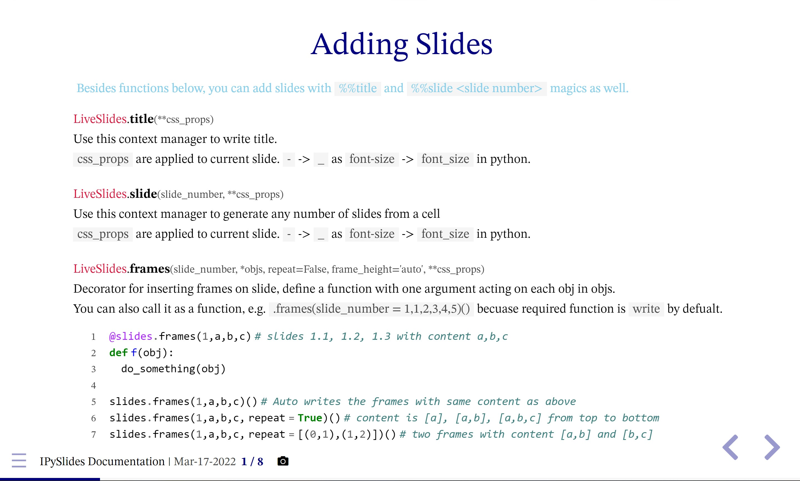

# IPySlides
Create Interactive Slides in [Jupyter](https://jupyter.org/)/[Voila](https://voila.readthedocs.io/en/stable/) with all kind of rich content. 

- Launch example Notebook [](https://mybinder.org/v2/gh/massgh/ipyslides-voila/HEAD?urlpath=lab%2Ftree%2Fnotebooks%2Fipyslides.ipynb)
- See a [Demo Notebook at Kaggle](https://www.kaggle.com/massgh/ipyslides). 
- See [PDF-Slides](IPySlides-Print.pdf)
- See [PDF-Report](IPySlides-Report.pdf)


# Changelog
Above version 1.4.0, users can see upto date documentation via `ipyslides.Slides().docs()`, so no additional changelog will be created in future. 
See old [changelog](changelog.md)

# Install
```shell
> pip install ipyslides >= 2.1.8
```
For development install, clone this repository and then
```shell
> cd ipyslides
> pip install -e .
```

> Jupyter Notebook version 7 is supported same way as Jupyter Lab in ipyslides >= 1.8.5
# Creating Slides
Inside Jupyter Notebook:

```python
#------------ Cell 1 --------------------
import ipyslides as isd 
slides = isd.Slides(**settings_kwargs) # settings_kwargs are added in 1.4.1
slides.settings.set_animation(main='zoom') # can be changed per slide in 1.7.6+
slides.xmd_syntax # Gives you information what you can do with markdown 1.7.2+
#------------ Cell 2 --------------------
%%title
# create a rich content title page
#------------ Cell 3 --------------------
%%slide 1 
# slide 1 content
#------------ Cell 4 --------------------
%%slide 1 -m # new in 1.4.6
Markdown here with extended options such as alert`this will be alerted in slides`. Nested blocks are not supported
    ```multicol 30 70
    less content
    +++
    more content in ||side by || side columns||. 
    ```
    ```python run source
    x = 1 + 2
    slides.write([x, source])
    ```
{{source}} will be shown in start here as well. Expressions are are not supported.

(1.8.9+) two dashes --- on their own line create multiple frames
#------------ Cell 5 --------------------
@slides.frames(1,*objs)
def func(obj):
    write(obj) #This will create as many slides after the slide number 1 as length(objs)
#------------ Cell 6 --------------------
slides # This displays slides if on the last line of cell, or use `slides.show()`.
```
#### You can load slides from a markdown file
slides separator should be --- (three dashes)
frames separator should be -- (two dashes)
```python
slides.from_markdown(start, path)
with slides.slide(2):
    write(slides[2].markdown) # write content of slide 2 from file
    plot_something() # Add other things to same file
    write_something()
```

#### You can see documentation slides with:
```python
slides.docs()
```
#### You can see a rich content demo of slides with:
```python
slides.demo()
```

> Check out `slides.glassmorphic` and `slides.clipboard_image` in 2.0.1+.

#### You can build html of slides 
Content type is limited. Widgets can not be exported.
```python
slides.export.report() # >= 1.6
slides.export.slides() # HTML Slides
```
When exported to HTML and then PDF is printed, this gives 
a clean document.

# Content Types to Embed
You can embed anything that you can include in Jupyter notebook like ipywidgets,HTML,PDF,Videos etc.,including jupyter notebook itself! 

> Note: Websites may refuse to load in iframe.

## IPython Display Objects
Any object with following methods could be in `write` command:
`_repr_pretty_`, `_repr_html_`, `_repr_markdown_`, `_repr_svg_`, `_repr_png_`, `_repr_jpeg_`, `_repr_latex_`, `_repr_json_`, `_repr_javascript_`, `_repr_pdf_`
Such as `IPython.display.<HTML,SVG,Markdown,Code>` etc. or third party such as `plotly.graph_objects.Figure`.

## Plots and Other Data Types (0.8.7+)
These objects are implemented to be writable in `write` command:
`matplotlib.pyplot.Figure`, `altair.Chart`, `pygal.Graph`, `pydeck.Deck`, `pandas.DataFrame`, `bokeh.plotting.Figure`.
Many will be extentended in future. If an object is not implemented, use `display(obj)` to show inline or use library's specific command to show in Notebook outside `write`.

## Interactive Widgets
Any object in `ipywidgets` or libraries based on `ipywidgtes` such as `bqplot`,`ipyvolume`,plotly's `FigureWidget`
can be included in `iwrite` command. `iwrite` also renders other objects except Javascript.

## Custom and Third Party Objects(not implemented in this library)
Starting version 1.6.1, you can add serialization method in current namespace. For example you can do something like this
```python
@slides.serializer.register(int)
def colorize(obj):
    color = 'red' if obj % 2 == 0 else 'green'
    return f'<span style="color:{color};">{obj}</span>'

slides.write(*range(10))
# This will color even odd integers differently
```

## Markdown Extensions
In 1.7.7+ you can install extensions of markdown e.g. [PyMdown](https://facelessuser.github.io/pymdown-extensions/) and use them as follows:
```python
slides.extender.extend(extension)
```
# Full Screen Presentation
- Jupyterlab 3.0+ has full screen eneabled from any view:
- Use [Voila](https://voila.readthedocs.io/en/stable/) for full screen prsentations. Your notebook remains same, it is just get run by Voila, may not work as expected.     

- Slides in Jupyter Lab are theme aware in `Inherit` theme mode, so theme of slides changes based on editor theme.

# PDF printing
To include all type of objects you need to make PDF manually.
Read instructions in side panel about PDF printing. See [PDF-Slides](IPySlides-Print.pdf)
If you just have HTML objects like `matplotolib plots`, `images`, `plotly`, `bokeh` charts etc. and not something like `ipywidgets`, see next section.
# HTML/PDF Report/Slides [HTML Slides in 1.5.2+]
- You can create beautiful HTML/PDF report from slides using `slides.export.report`. See [PDF-Report](IPySlides-Report.pdf)
- You can use CSS classes `.report-only` and `.slides-only` to create different content for both sceberios. Content variety is limited. Widgets can not be exported. 
- Use `slides.export.slides` to build static slides that you can print as well. Widgets are not exported.
# Speaker Notes (1.2.0+) (Experimental)
- You can turn on speaker notes with a `Show Notes` check in side panel. Notes can be added to slides using `slides.notes.insert` (`slides.notes` in < 1.2.1) command. 
- Notes is an experimantal feuture, so use at your own risk. Do not share full screen, share a brwoser tab for slides and you can keep notes hidden from audience this way. 
# Known Limitations
- Slide number is necessary to be tracked by user, as notebook cells are not linked to each other and multiple runs of a cell can lead to adding many slides with same content. In version `2.1.7+` you can use property `Slides.auto_number` inside Python script, but avoid it in Notebook since it does not run linearly and can create hundreds of slides as you keep running cells.
- Bounding box of slides for screenshots should be set by user (if not in fullscreen).

# Customize Slides
You can customize slides by inheriting from `Slides` class. 
For example if you want to have custom theme and some other settings always enabled and
bottom information only on title slide, you can do so:
```python
class CustomSlides(isd.Slides):
    def __init__(self):
        super().__init__()
        self.settings.theme_dd.value = 'Custom'
        self.progress_slider.observe(self.set_visible, names=['index'])
    
    def set_visible(self, change):
        if self.progress_slider.index == 0:
            self.widgets.footerbox.layout.visibility = 'visible'
        else:
            self.widgets.footerbox.layout.visibility = 'hidden'
```

> Very thankful to [Python-Markdown](https://python-markdown.github.io/) which enabled to create `write` command as well as syntax highliting.