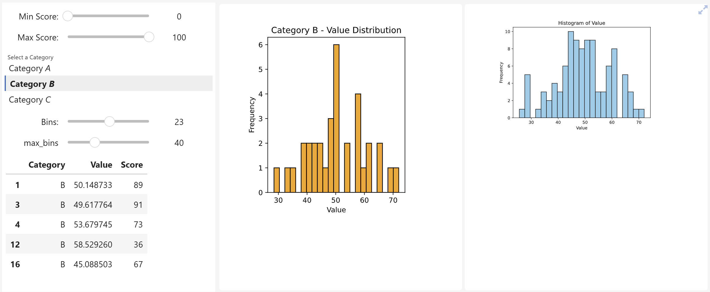

# einteract

An enhanced interactive widget that let's you observe any trait of widgets, observe multiple functions and build beautiful dashboards which can be turn into full screen. This is a wrapper library around interact functionality in [ipyslides](https://github.com/asaboor-gh/ipyslides) which also provides rich content representations. 

See code of this simple yet full customizable dashboard on binder 
