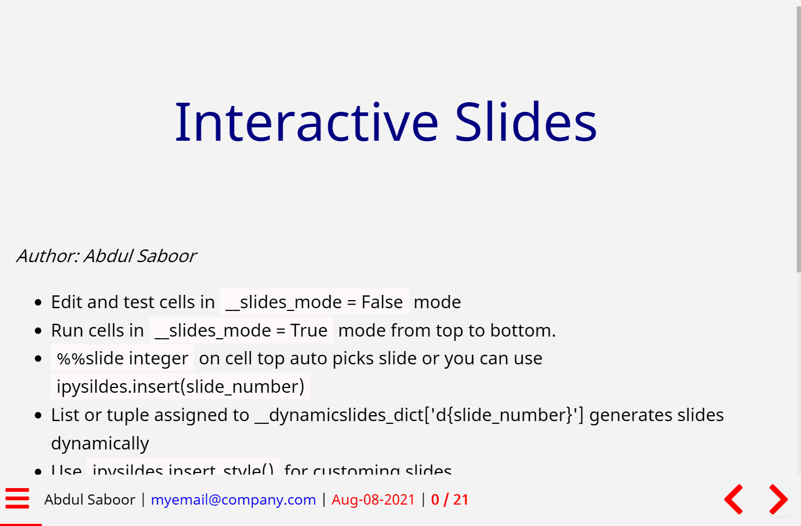

# ipyslides
Create Interactive Slides in [Jupyter](https://jupyter.org/)/[Voila](https://voila.readthedocs.io/en/stable/) with all kind of rich content. 


# Install
```shell
> pip install ipyslides
```
For development install, clone this repository and then
```shell
> cd ipyslides
> pip install -e .
```
# Demo
See a [Demo Notebook at Kaggle](https://www.kaggle.com/massgh/ipyslides),
[Version>0.2.0]https://www.kaggle.com/massgh/ipyslides-0-2-0)


# Usage
```python
import ipyslides as isd 

isd.initilize() #This will create a title page and parameters in same cell

isd.write_title() #create a rich content multicols title page.

isd.insert(1) #This will create a slide in same cell where you run it 

isd.insert_after(1,*objs) #This will create as many slides after the slide number 1 as length(objs)

isd.build() #This will build the presentation cell. After this go top and set `convert2slides(True)` and run all below.
```
> Each command is replaced by its output, so that when you run next time, you don't get duplicate slides. 

> For jupyterlab >= 3, do pip install sidecar for better presenting mode.


## Content Types to Embed
You can embed anything that you can include in Jupyter notebook like ipywidgets,HTML,PDF,Videos etc.,including jupyter notebook itself! I am not kidding, see 
> Note: Websites may refuse to load in iframe. Jupyterlab was loaded inside itself, but refused in Voila. 

# Full Screen Presentation
- Use [Voila](https://voila.readthedocs.io/en/stable/) for full screen prsentations. Your notebook remains same, it is just get run by [Voila](https://voila.readthedocs.io/en/stable/).     
[Jupyterlab-Sidecar](https://github.com/jupyter-widgets/jupyterlab-sidecar) does not give 100% full screen experience but it is more useful in context of content types you can use e.g. showing magic of codeing inside slides!

# Multi Column Support
Starting version 0.2.0, you can use `MultiCols` class to display connected content like `ipwidgets` in columns. 

> Very thankful to [Python-Markdown](https://python-markdown.github.io/) which enabled to create `write` command as well as syntax highliting.