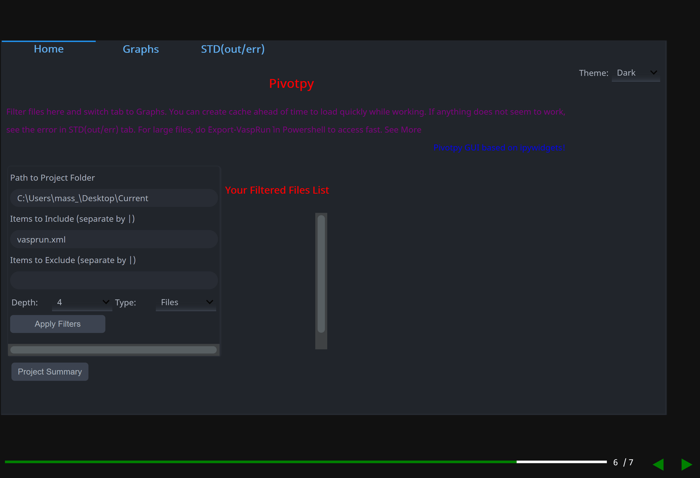

# ipyslides
Create Interactive Slides in [Jupyter](https://jupyter.org/)/[Voila](https://voila.readthedocs.io/en/stable/) with all kind of rich content. 

Launch example Notebook [](https://mybinder.org/v2/gh/massgh/ipyslides-voila/HEAD?urlpath=lab%2Ftree%2Fnotebooks%2Fipyslides-0-2-0.ipynb)


# New in Version >= 0.7
- LiveSlides now collect slides internally, so removing a lot of code user had to put. 
- You can elevate simple cell output to fullscreen in Jupyterlab >= 3.
- You can use `with slide(<N>)` context manager to build multiple slides in for loop from a single cell. This
context manager is equivalent to `%%slide` so make sure none of them overwrite each other.
- Widgets display is persistent in `%%slide`,`with slide` and `insert_after` mode, however `multicols` display ipywidgets once and then they disappear (No idea yet why it happens), so avoid displaying widgets in mutlicols mode.

# Install
```shell
> pip install ipyslides
```
For development install, clone this repository and then
```shell
> cd ipyslides
> pip install -e .
```
# Demo
See a [Demo Notebook at Kaggle](https://www.kaggle.com/massgh/ipyslides),
[Version 0.2+](https://www.kaggle.com/massgh/ipyslides-0-2-0),
[Version 0.7+](https://www.kaggle.com/massgh/ipyslides-0-7). You can edit it yourself.


# Usage
```python
import ipyslides as isd 

isd.initilize() #This will create a title page and parameters in same cell

isd.write_title() #create a rich content multicols title page.

isd.insert(1) #This will create a slide in same cell where you run it 

isd.insert_after(1,*objs,func) #This will create as many slides after the slide number 1 as length(objs)

isd.build() #This will build the presentation cell. After this go top and set `convert2slides(True)` and run all below.
```
> Each command is replaced by its output, so that when you run next time, you don't get duplicate slides. 

> For jupyterlab >= 3, do pip install sidecar for better presenting mode.

## Content Types to Embed
You can embed anything that you can include in Jupyter notebook like ipywidgets,HTML,PDF,Videos etc.,including jupyter notebook itself! 

> Note: Websites may refuse to load in iframe.
> Note: You can embed slides inside other slides using `ipyslides.insert_after(<N>,other_slides.box)`. This is very cool.

# Full Screen Presentation
- Use [Voila](https://voila.readthedocs.io/en/stable/) for full screen prsentations. Your notebook remains same, it is just get run by [Voila](https://voila.readthedocs.io/en/stable/).     
- Install [Jupyterlab-Sidecar](https://github.com/jupyter-widgets/jupyterlab-sidecar) for version < 4. Fullscreen support is added natively in version > 0.4!
- Version >= 0.5.1 is Jupyter Notebook theme aware in `Inherit` theme, so theme of slides changes based on editor theme.
- Version >= 0.6.3 enables full size output in Jupyterlab's `Create New Output View` command. Then in Setting panel, you can toggle fullscreen.
- Version >= 0.7.0 do not require to install sidecar or New Output view. You can make slides fullscreen just from cell output! Note that all this is currently supported only in Jupyterlab, other editors or classic notebook are not supported. 

# Multi Column Support
Starting version 0.2.0, you can use `MultiCols` class to display connected content like `ipwidgets` in columns. 

> Very thankful to [Python-Markdown](https://python-markdown.github.io/) which enabled to create `write` command as well as syntax highliting.