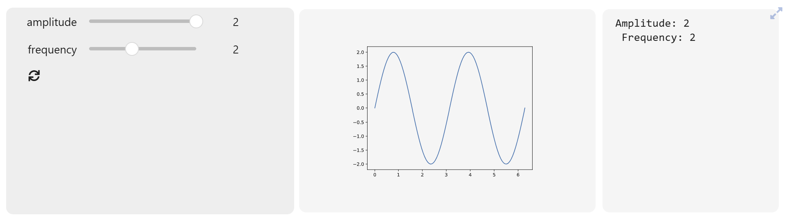

# einteract

[](https://mybinder.org/v2/gh/asaboor-gh/einteract/HEAD?urlpath=%2Fdoc%2Ftree%2Feinteract-demo.ipynb)
[](https://badge.fury.io/py/einteract)
[](https://pepy.tech/project/einteract)

An enhanced interactive widget that lets you observe any trait of widgets, observe multiple functions and build beautiful dashboards which can be turned into full screen. This is a wrapper library around interact functionality in [ipyslides](https://github.com/asaboor-gh/ipyslides) which also provides rich content representations. 



See code of this simple yet fully customizable dashboard on binder [](https://mybinder.org/v2/gh/asaboor-gh/einteract/HEAD?urlpath=%2Fdoc%2Ftree%2Feinteract-demo.ipynb)

## Installation

You can install einteract using pip:

```bash
pip install einteract
```

Or if you prefer to install from source, clone the repository and in its top folder, run:

```bash
pip install -e .
```

## Features

- **InteractBase**: Create interactive dashboard applications with minimal code by extending the `InteractBase` class and defining methods with the `@callback` decorator.
- **Custom Widgets**: 
    - Included custom built widgets for enhanced interaction. 
    - Pass any DOMWidget as a parameter to `interact/interactive` functions unlike default `ipywidgets.interactive` behavior.
    - Observe any trait of the widget by `'widget_name.trait_name'` where `'widget_name'` is assigned to a `widget`/`fixed(widget)` in control parameters, OR `'.trait_name'` if `trait_name` exists on instance of interactive.
    - You can use '.fullscreen' to detect fullscreen change and do actions based on that.
    - Add `ipywidgets.Button` to hold callbacks which use it as paramter for a click
- **Plotly Integration**: Modified plotly support with additional traits like `selected` and `clicked`
- **Matplotlib Support**: Convert matplotlib plots to HTML format using `plt2html`
- **Event Callbacks**: Easy widget event handling with the `@callback` decorator inside the subclass of `InteractBase` or multiple functions in `interact/interactive` functions.
- **Full Screen Mode**: Transform your dashboards into full-screen applications by added button.

## Quick Start

```python
import numpy as np
import matplotlib.pyplot as plt
import ipywidgets as ipw
import einteract import as ei

@ei.interact(
    ei.classed(lambda smax: print(f"Maximum amplitude: {smax}"), 'out-smax'),
    slider = ipw.fixed(ipw.IntSlider(min=1,max=10)), 
    frequency = (0.1, 20.0,5), 
    smax = 'slider.max',
    amp = 'slider.value',
    app_layout = {'left_sidebar': ['slider','frequency', 'out-smax'], 'center':['out-0']}
)
def plot_sine(amp=1.0, frequency=5.0):
    plt.figure(figsize=(8, 4))
    X = np.linspace(0,10,100)
    plt.plot(X, amp * np.sin(frequency*X)) # amplited is passed as slider
    plt.grid(True)
    plt.show()
```


## Comprehensive Examples
- Check out the [einteract-demo.ipynb](einteract-demo.ipynb) which demonstates subclassing `InteractBase`, using custom widgets, and observing multiple functions through the `@callback` decorator.
- See [Bandstructure Visualizer](https://github.com/asaboor-gh/ipyvasp/blob/d181ba9a1789368c5d8bc1460be849c34dcbe341/ipyvasp/widgets.py#L642) and [KPath Builder](https://github.com/asaboor-gh/ipyvasp/blob/d181ba9a1789368c5d8bc1460be849c34dcbe341/ipyvasp/widgets.py#L935) as comprehensive dashboards.
