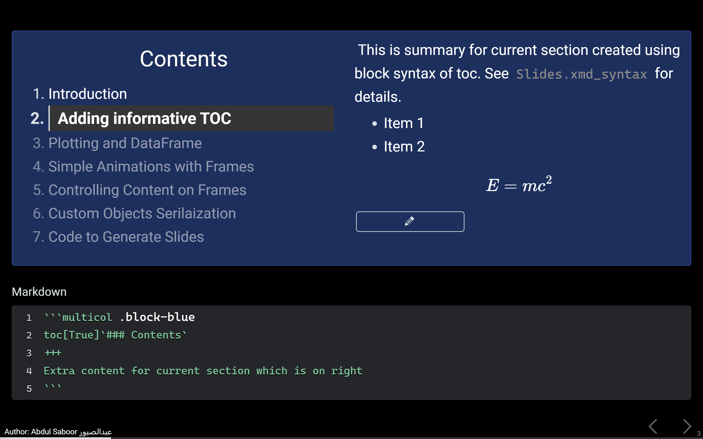

# IPySlides

[](https://doi.org/10.5281/zenodo.15482350)
[](https://mybinder.org/v2/gh/massgh/ipyslides/HEAD?labpath=demo.ipynb)
[](https://asaboor-gh.github.io/einteract-docs/lab/index.html?path=IPySlides.ipynb)
[](https://badge.fury.io/py/ipyslides)
[](https://pepy.tech/project/ipyslides)

<svg width="1.25em" viewBox="0 0 50 50" xmlns="http://www.w3.org/2000/svg" fill="none" stroke="currentColor" stroke-linecap="butt" stroke-linejoin="round" stroke-width="7.071067811865476">
   <path d="M22.5 7.5L10 20L20 30L30 20L40 30L27.5 42.5" stroke="teal"/>
   <path d="M7.5 27.5L22.5 42.5" stroke="crimson"/>
   <path d="M32.5 32.5L20 20L30 10L42.5 22.5" stroke="red"/>
</svg>  IPySlides is a Python library for creating interactive presentations in Jupyter notebooks. It combines the power of Markdown, LaTeX, interactive widgets, and live variable updates in a single presentation framework.

---

<p float="left"> 
  
  
</p>

---

## Features

- 📊 Support for plots, widgets, and rich media
- 🎨 Customizable themes and layouts
- 📱 Responsive design for various screen sizes
- 📤 Export to HTML/PDF (limited content type)
- 🎯 Frame-by-frame animations
- 📝 Speaker notes support
- 🔄 Markdown, citations and settings files synchronization
- ✏️ Drawing support during presentations

--- 

## Quick Start

1. **Install:**
```bash
pip install ipyslides        # Basic installation
pip install ipyslides[extra] # Full features
```

2. **Create Slides:**
```python
import ipyslides as isd
slides = isd.Slides()

# Add content programmatically
slides.build(-1, """
# My First Slide
- Point 1
- Point 2
$E = mc^2$
""")

# Or use cell magic
%%slide 0
# Title Slide
Welcome to IPySlides!
```

3. **Run Examples:**
```python
slides.docs()  # View documentation
slides.demo()  # See demo presentation
```

**✨ Try it in your browser ✨**
| Jupyterlite  | Binder |
|--------------|--------|
|[](https://asaboor-gh.github.io/einteract-docs/lab/index.html?path=IPySlides.ipynb) | [](https://mybinder.org/v2/gh/massgh/ipyslides/HEAD?labpath=demo.ipynb) |

---

## Content Types

Support for various content types including:

- 📜 Extended Markdown, see `slides.xmd_syntax`
- 📊 Plots (Matplotlib, Plotly, Altair)
- 🔧 Interactive Widgets
- 📷 Images and Media
- ➗ LaTeX Equations
- ©️ Citations and References
- 💻 Auto update variables in markdown
- 🎥 Videos (YouTube, local)
- 🎮 Enhanced interactive widgets (with fullscreen support, thanks to `anywidget`)

```python
import numpy as np
from ipywidgets import HTML

@slides.ei.interact(html = HTML(), amplitude= (0, 2),frequency=(0, 5))
def plot(html, amplitude, frequency):
    x = np.linspace(0, 2*np.pi, 100)
    y = amplitude * np.sin(frequency    * x)
    plt.plot(x, y)
    html.value = slides.plt2html(). value
```

- For comprehensive dashbords, subclass `InteractBase`

```python
import numpy as np
from ipywidgets import HTML
from ipyslides.interaction import InteractBase, callback 

class MyDashboard(InteractBase):
    def _interactive_params(self): # Define interactive parameters
        return {
            'html': HTML(),
            'amplitude': (0, 2),
            'frequency': (0, 5),
        }

    @callback
    def plot(self, html, amplitude, frequency):
        x = np.linspace(0, 2*np.pi, 100)
        y = amplitude * np.sin(frequency * x)
        plt.plot(x, y)
        html.value = slides.plt2html().value
    
    @callback('out-text')
    def text(self, amplitude, frequency):
        print(f"Amplitude: {amplitude}\n Frequency: {frequency}")

dash = MyDashboard(auto_update=False)
dash.set_layout( # Can also be set via post_init callback
    left_sidebar = dash.groups.controls, 
    center = ['html','out-text'], # out-plot, out-text collected in center
    pane_widths = [3,5,0]
)
dash.set_css(
    main = { # can also be set via post_init callback
        'grid-gap': '4px', 'margin': '8px',
        '.left-sidebar': {'background': '#eee','border-radius': '8px'},
    },
    center = { # can be set in main through '> .center' selector
        '> *': {'background-color': 'whitesmoke', 'border-radius': '8px','padding':'8px'}
        'grid-template-columns': '5fr 3fr', # side-by-side layout for outputs
        'grid-gap': '4px', # central grid gap
        '> *': {'background-color': 'whitesmoke', 'border-radius': '8px','padding':'8px'}
})
display(dash)
```

See more examples in [einteract repository](https://github.com/asaboor-gh/einteract) and on [](https://mybinder.org/v2/gh/asaboor-gh/einteract/HEAD?urlpath=%2Fdoc%2Ftree%2Feinteract-demo.ipynb).

- And much more!

---

## Export Options

- **HTML Export**<br/>
Use `slides.export_html` to build static slides that you can print as well. Read export details in settings panel, where you can also export with a single click.

- **PDF Export**
1. Export to HTML first
2. Open in Chrome/Edge browser
3. Use Print → Save as PDF and enable background graphics

Navigate to [Documentation](https://asaboor-gh.github.io/ipyslides/) to see HTML slides which you can print to PDF.

---

## Advanced Features
- **Custom Objects Serialization:**
    - You can serialize custom objects to HTML using `Slides.serializer` API.
    - You can extend markdown syntax using `Slides.extender` API. See some good extensions to add from [PyMdown](https://facelessuser.github.io/pymdown-extensions/).

- **Speaker Notes:**
    Enable via Settings Panel → Show Notes
    and add notes via `slides.notes`.

- **Custom Styling:**
```python
slides.set_css({ # on all slides or slide[index,].set_css() per slide
    '--bg1-color': '#f0f0f0',
    '--text-color': '#333'
})
```

- **File Sync:**
    Live edit a linked markdown file that updates slides in real-time using `slides.sync_with_file`.

---

## Caveats

1. **Markdown Cells:** 
   - Jupyter markdown cells are not processed by IPySlides
   - Instead, you can use `%%slide number -m` cell magic and link an external markdown file using `slides.sync_with_file`

2. **Slide Numbering:**
   - Use `-1` for automatic slide numbering
   - Manual numbering requires careful tracking to avoid overwriting slides

3. **Speaker Notes:**
   - Experimental feature - use with caution

---

## Development

```bash
git clone https://github.com/asaboor-gh/ipyslides.git
cd ipyslides
pip install -e .
```

## Contributing

Contributions are welcome! Please feel free to submit a Pull Request.

---

## Documentation

- [Github Pages Documentation](https://asaboor-gh.github.io/ipyslides/)
- Full documentation: `slides.docs()` same as on github pages.
- Examples: `slides.demo()`
- [GitHub Repository](https://github.com/asaboor-gh/ipyslides)


## Acknowledgements

- [ipywidgets](https://github.com/jupyter-widgets/ipywidgets) & [anywidget](https://github.com/manzt/anywidget)
- [IPython](https://github.com/ipython/ipython)
- [Python-Markdown](https://python-markdown.github.io/)

---

Made with ❤️ by Abdul Saboor
